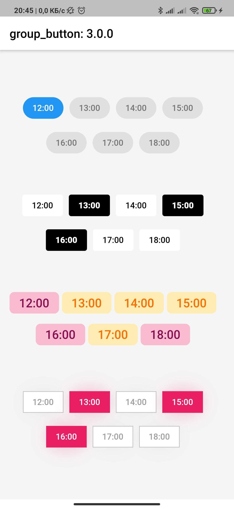
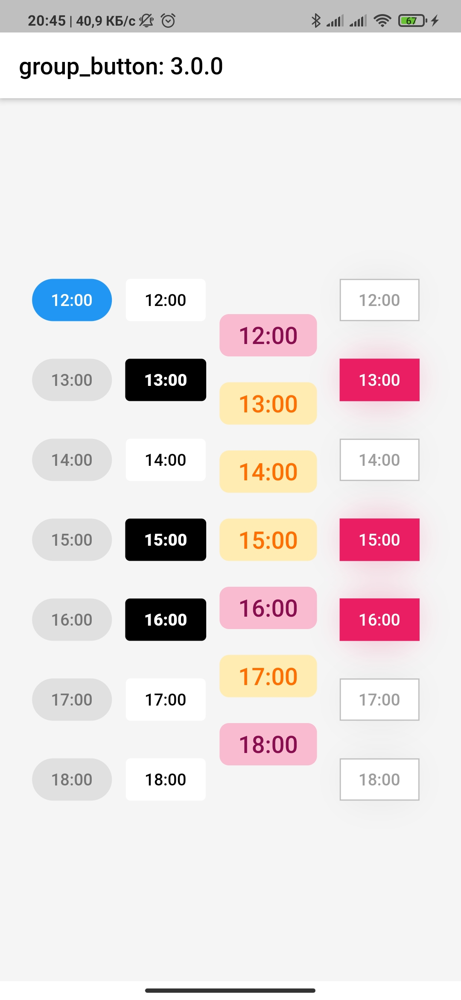
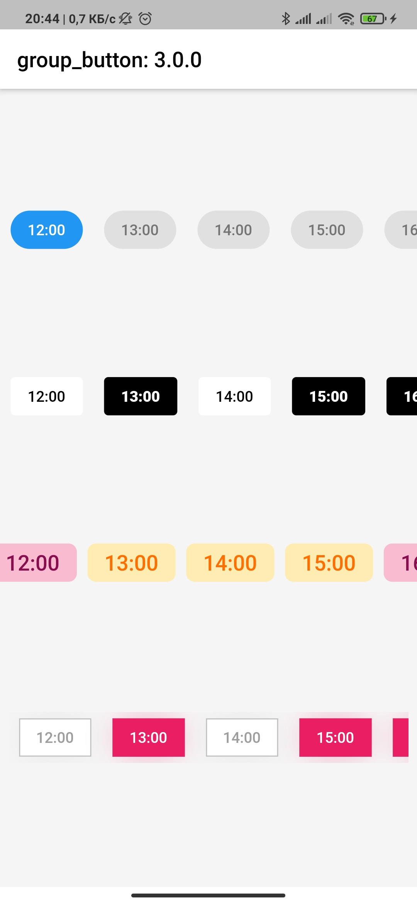

<div align="center">
  
</div>
<h2 align="center">Flutter widget to create a group of buttons fast 🚀</h2>
<p align="center">
   Included Radio and CheckBox buttons models with custom groping types 🤤
   <br>
   <span style="font-size: 0.9em"> Show some ❤️ and <a href="https://github.com/Frezyx/group_button">star the repo</a> to support the project! </span>
</p>
<br>

<p align="center">
<!--   <a href="https://travis-ci.com/Frezyx/group_button"></a> -->
  <a href="https://pub.dev/packages/group_button"></a>
  <a href="https://github.com/Frezyx/group_button"></a>
  <a href="https://opensource.org/licenses/MIT"></a>
</p>
<p align="center">
  <a href="https://pub.dev/packages/group_button/score"></a>
  <a href="https://pub.dev/packages/group_button/score"></a>
  <a href="https://pub.dev/packages/group_button/score"></a>
</p>

|  |  |  | 
| :------------: | :------------: | :------------: |


## Getting Started
Follow these steps to use this package

### Add dependency

```yaml
dependencies:
  group_button: ^3.3.1 #latest version
```

### Add import package

```dart
import 'package:group_button/group_button.dart';
```

### Easy to use
Simple example of use GroupButton<br>
Put this code in your project at an screen and learn how it works 😊

```dart
GroupButton(
    isRadio: false,
    spacing: 10,
    onSelected: (index, isSelected) => print('$index button is selected'),
    buttons: ["12:00", "13:00", "14:30", "18:00", "19:00", "21:40"],
)
```

### Customize

In order to customize your buttons inside *GroupButton* you can use code below</br>
This code includes *all* the fields used in *GroupButton*

```dart
GroupButton(
    spacing: 5,
    isRadio: false,
    direction: Axis.horizontal,
    onSelected: (index, isSelected) =>
          print('$index button is ${isSelected ? 'selected' : 'unselected'}'),
    buttons: ["Dart","Kotlin","Java","Swift","Objective-C","Python","JS"],
    selectedButtons: [0, 1], /// [List<int>] after 2.2.1 version 
    selectedTextStyle: TextStyle(
        fontWeight: FontWeight.w600,
        fontSize: 16,
        color: Colors.red,
    ),
    unselectedTextStyle: TextStyle(
        fontWeight: FontWeight.w600,
        fontSize: 14,
        color: Colors.grey[600],
    ),
    selectedColor: Colors.white,
    unselectedColor: Colors.grey[300],
    selectedBorderColor: Colors.red,
    unselectedBorderColor: Colors.grey[500],
    borderRadius: BorderRadius.circular(5.0),
    selectedShadow: <BoxShadow>[BoxShadow(color: Colors.transparent)],
    unselectedShadow: <BoxShadow>[BoxShadow(color: Colors.transparent)],
)
```

### Examples

You can check more examples of using this package [here](https://github.com/Frezyx/group_button/tree/create-provider-example/example/lib)

<br>

### Attributes

| Attribute  | Annotation |
| ------------- | ------------- |
| buttons | [String] list that will be displayed on buttons in the [GroupButton] |
| selectedButtons | [List<int>] that will be set initial selected buttons in the [GroupButton] when [isRadio] is false|
| selectedButton | [int] that will be set initial selected button in the [GroupButton] when [isRadio] is true|
| onSelected  | Callback [Function] works by clicking on a group element <br> Return int [index] of selected button and [isSelected] if [isRadio] = false |
| isRadio | bool variable for switching between modes [ChackBox] and [Radio]<br>if the [isRadio] = true, only one button can be selected<br>if the [isRadio] = false, you can select several at once |
| direction | The direction of arrangement of the buttons in [GroupButton] |
| spacing | The spacing between buttons inside [GroupButton] |
| runSpacing | When [groupingType] is [GroupingType.wrap] this field sets Wrap [runSpacing] |
| selectedTextStyle | [TextStyle] of text of selected button(s) |
| unselectedTextStyle | [TextStyle] of text of unselected buttons |
| selectedColor | background [Color] of selected button(s) |
| unselectedColor | background [Color] of  unselected buttons |
| selectedBorderColor | border [Color] of selected button(s) |
| unselectedBorderColor | border [Color] of  unselected buttons |
| borderRadius | [BorderRadius] of  buttons<br>How much the button will be rounded |
| selectedShadow | list of selected button(s) [BoxShadow] |
| unselectedShadow| list of unselected buttons [BoxShadow] |
| groupingType| The field is responsible for how the buttons will be grouped [GroupingType] |
| mainGroupAlignment| How the buttons should be placed in the main axis in a layout [MainGroupAlignment] |
| crossGroupAlignment| How the buttons should be placed along the cross axis in a layout [CrossGroupAlignment] |
| groupRunAlignment| How the button runs themselves should be placed the cross axis in a layout [GroupRunAlignment] |
| textAlign| The buttons text alignment [GroupButton] |
| textPadding| The inner padding of buttons [GroupButton] |
| alignment| [AlignmentGeometry] Text position inside the buttons in case [buttonWidth] or [buttonHeight] defined |
| elevation| [double] The buttons' elevation |
| disabledButtons| [int] button ids that are disabled |

<br>
<div align="center" >
  <p>Thanks to all contributors of this package</p>
  <a href="https://github.com/Frezyx/group_button/graphs/contributors">
    
  </a>
</div>
<br>

For help getting started with 😍 Flutter, view
[online documentation](https://flutter.dev/docs), which offers tutorials, 
samples, guidance on mobile development, and a full API reference.


